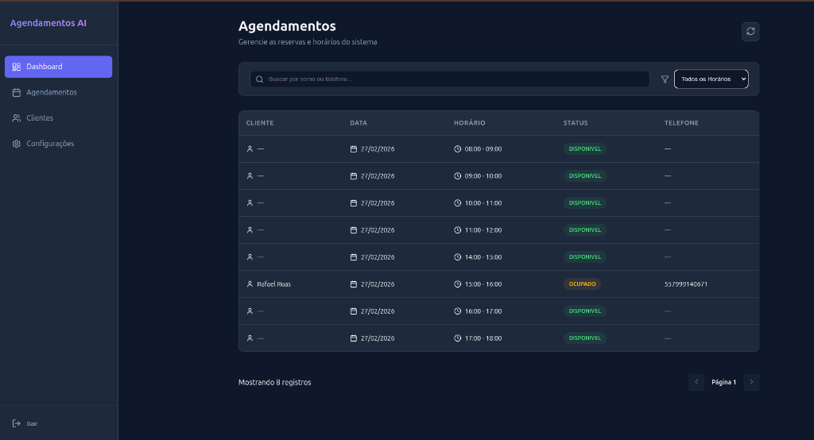
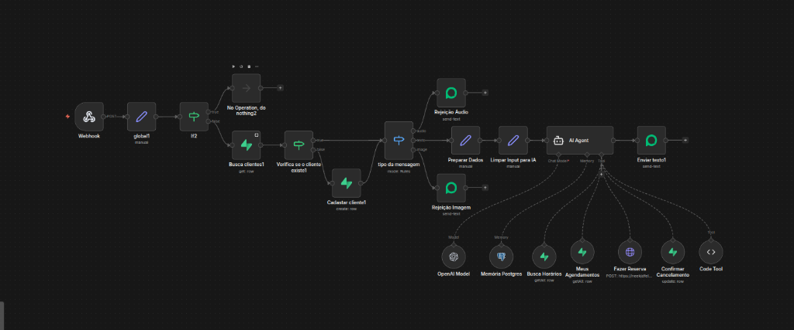

# AI WhatsApp Scheduler

Bilingual project documentation for a full stack appointment scheduling system powered by Artificial Intelligence and integrated with WhatsApp.

This project consists of an automated scheduling agent and a management dashboard, combining automation with n8n, database management with Supabase, and a modern interface in React.

## Project Preview / Demonstração do Projeto

### n8n Agent Workflow

### Management Dashboard

### Video Demonstration
[Watch the system in action on YouTube](https://youtu.be/my2K4YxFeAI)

---

## English

### Project Overview
The AI WhatsApp Scheduler is a production ready solution for businesses that need to automate appointment bookings. It uses natural language processing to understand customer requests via WhatsApp, managing the database in real time and providing an administrative interface for monitoring.

### Key Features
1. Conversational AI Agent: Responds to customers on WhatsApp to book, list, or cancel appointments.
2. Automated Slot Management: Daily engine that generates available time slots based on configurable business hours.
3. Administrative Dashboard: Real time React interface to manage clients, monitor bookings, and adjust settings.
4. Intelligent Validation: Filters for audio and image messages, requesting text for better processing.
5. Client Registration: Automatically identifies and registers new clients during the first interaction.

### Architecture
1. n8n (Orchestration): Manages the logic flow between WhatsApp, AI, and the database.
2. Evolution API: Connects the WhatsApp instance to the n8n webhooks.
3. Supabase (Backend): PostgreSQL database with real time subscriptions and built in authentication.
4. OpenAI: Language model used for intent classification and deterministic tool calling.

### Tech Stack
1. Frontend: React 19, Vite, Lucide React, Supabase JS.
2. Backend and Automation: n8n, Evolution API, OpenAI.
3. Database: PostgreSQL (via Supabase).

### Installation and Setup
1. Database: Execute the SQL schema in Supabase to create the clients, agenda_slots, and agenda_config tables.
2. n8n Workflows: Import the agenda_engine and Agente de Agendamento workflows into your n8n instance.
3. WhatsApp: Connect your WhatsApp instance via Evolution API and point the webhook to the n8n entry point.
4. Dashboard: Configure the environment variables with your Supabase credentials and run npm install followed by npm run dev.

***

## Portugues

### Visao Geral do Projeto
O AI WhatsApp Scheduler e uma solucao pronta para producao destinada a empresas que precisam automatizar o agendamento de consultas. Ele utiliza processamento de linguagem natural para entender os pedidos dos clientes via WhatsApp, gerenciando o banco de dados em tempo real e fornecendo uma interface administrativa para monitoramento.

### Principais Recursos
1. Agente de IA Conversacional: Responde aos clientes no WhatsApp para agendar, listar ou cancelar compromissos.
2. Gerenciamento Automatico de Vagas: Motor diario que gera slots de horario disponiveis com base em horas comerciais configuraveis.
3. Painel Administrativo: Interface React em tempo real para gerenciar clientes, monitorar reservas e ajustar configuracoes.
4. Validacao Inteligente: Filtros para mensagens de audio e imagem, solicitando texto para melhor processamento.
5. Cadastro de Clientes: Identifica e cadastra automaticamente novos clientes durante a primeira interacao.

### Arquitetura
1. n8n (Orquestracao): Gerencia o fluxo de logica entre o WhatsApp, a IA e o banco de dados.
2. Evolution API: Conecta a instancia do WhatsApp aos webhooks do n8n.
3. Supabase (Backend): Banco de dados PostgreSQL com inscricoes em tempo real e autenticacao integrada.
4. OpenAI: Modelo de linguagem utilizado para classificacao de intencao e chamada deterministica de ferramentas.

### Stack Tecnologica
1. Frontend: React 19, Vite, Lucide React, Supabase JS.
2. Backend e Automacao: n8n, Evolution API, OpenAI.
3. Banco de Dados: PostgreSQL (via Supabase).

### Instalacao e Configuracao
1. Banco de Dados: Execute o esquema SQL no Supabase para criar as tabelas clients, agenda_slots e agenda_config.
2. Fluxos n8n: Importe os fluxos agenda_engine e Agente de Agendamento para sua instancia do n8n.
3. WhatsApp: Conecte sua instancia do WhatsApp via Evolution API e aponte o webhook para o ponto de entrada do n8n.

4. Dashboard: Configure as variaveis de ambiente com suas credenciais do Supabase e execute npm install seguido de npm run dev.

***

### Desenvolvido por / Developed by
Camilo Ruas
